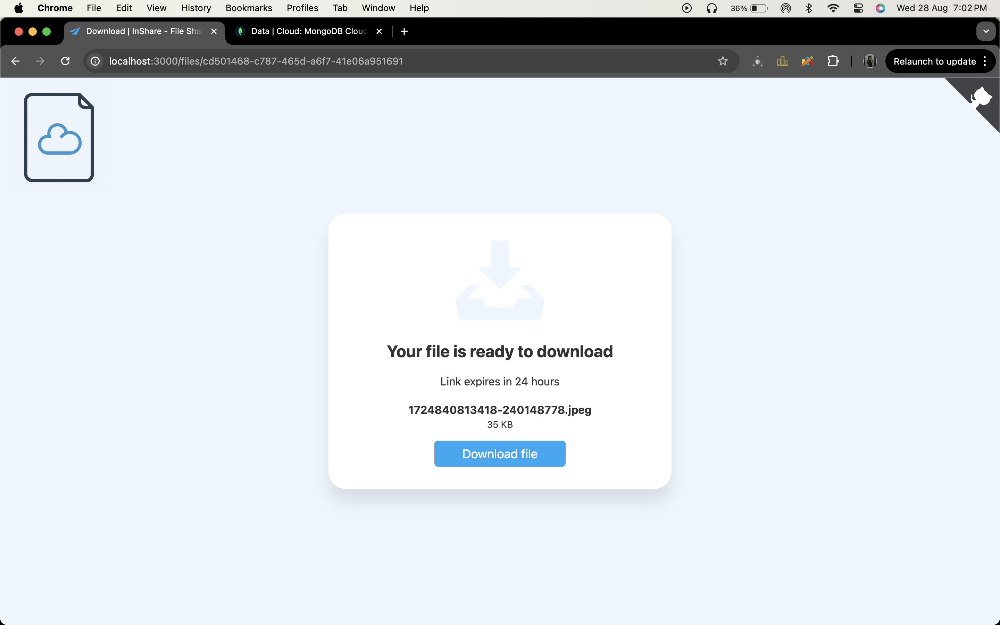

# File Sharing Web App - Backend

This repository contains the back-end part of a file-sharing web application. This was a group project, and I was responsible for developing the back-end. The application allows users to upload files to the server and generate a shareable download link. The link is valid for 24 hours and can be sent directly to the recipient via email.

## Features

- **File Upload**: Users can upload files to the server, which then returns a shareable download link.
- **Link Expiry**: The download link is valid for 24 hours after the file is uploaded.
- **Email Notification**: Users have the option to send the download link directly to the recipient's email.
- **Secure File Access**: The file can only be accessed using the link generated after upload.

## Technologies Used

- **Node.js**: JavaScript runtime environment for building the back-end.
- **Express.js**: Web framework for handling routes and server-side logic.
- **MongoDB**: NoSQL database used to store file metadata and manage links.
- **Multer**: Middleware for handling file uploads.
- **Nodemailer**: Library used to send emails via SMTP.
- **Mongoose**: MongoDB object modeling tool for managing database interactions.

## Screenshots

### Download Page



### Email Sent to Recipient


## Project Structure

```plaintext
├── config
│   └── db.js          # MongoDB connection configuration
├── routes
│   ├── files.js       # Routes for file upload and storage
│   ├── show.js        # Routes for displaying the file download page
│   └── download.js    # Routes for handling file downloads
├── views
│   └── *.ejs          # EJS templates for rendering HTML pages
├── public             # Static files (CSS, JS, etc.)
├── server.js          # Main server file
└── .env               # Environment variables (not included)

